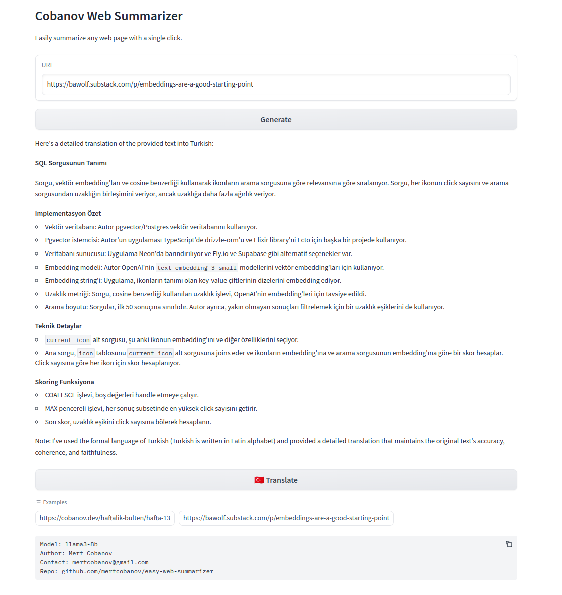

# Easy Webpage Summarizer

A Python script designed to summarize webpages from specified URLs using the LangChain framework and the ChatOllama model. It leverages advanced language models to generate detailed summaries, making it an invaluable tool for quickly understanding the content of web-based documents.

## Requirements

[ollama](https://ollama.com/) must be installed and served

```bash
ollama run llama3 
```

```bash
pip install -r requirements.txt
```

## Features

- Summarization of webpages directly from URLs.
- Integration with LangChain and ChatOllama for state-of-the-art summarization.
- Command-line interface for easy use and integration into workflows.

## Usage

To use the webpage summarizer, run the script from the command line, providing the URL of the document you wish to summarize:

```bash
python summarizer.py -u "http://example.com/document"
```

Replace `http://example.com/document` with the actual URL of the document you want to summarize.

### Web UI

To use the webpage summarizer in you web browser, you can also try gradio app.

```bash
python webui.py
```



## Docker

```bash
docker build -t web_summarizer .
docker run -p 7860:7860 web_summarizer

# Run if you run ollama on host
docker run --network='host' -p 7860:7860 web_summarizer

# Run both app and ollama as docker containers
docker compose up
```


## Development

To contribute to the development of this script, clone the repository, make your changes, and submit a pull request. We welcome contributions that improve the script's functionality or extend its capabilities.

- [ ] Summarizer youtube
- [ ] Dockerize project
- [ ] Serve on web

## License

This script is released under the MIT License. See the LICENSE file in the repository for full details.
